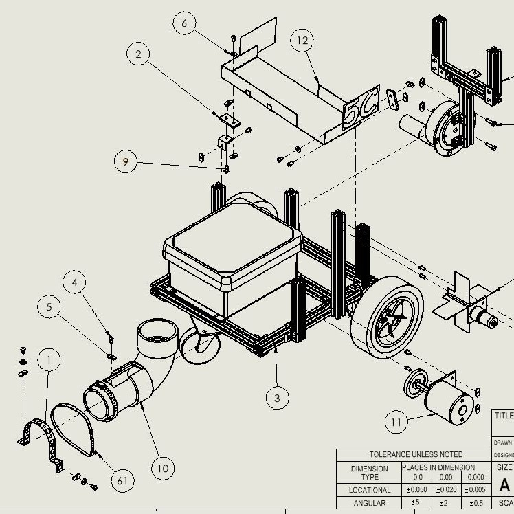
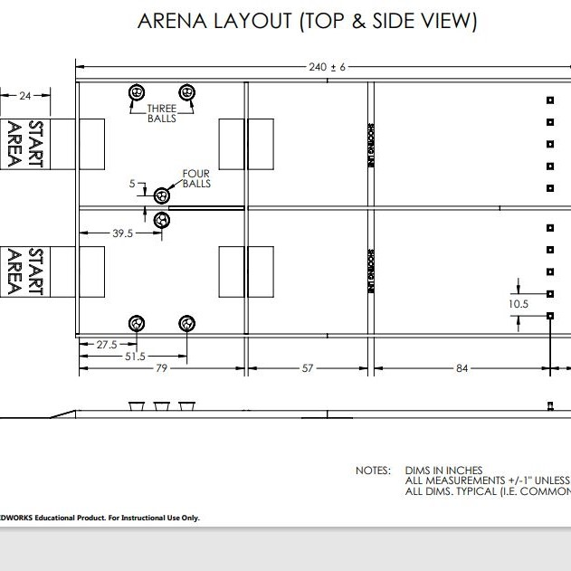
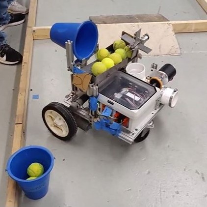

In my Junior year at UF I had a chance to participate in the Design and Manufactuing program at UF. During this class, me and my teammates were tasked with creating a robot that could navigate an obstacle course, retrieve tennis balls, and then launch those tennis balls to knock over targets. We started from scratch making handmade drawings and worked through CAD modeling, detailed analysis, and manufacturing stages in order to create the final robot. 

During this project, I was mainly focused on CAD assembly and manufacturing. I used SolidWorks to combine the hundreds of parts we modeled into the overall assembly. Then I used the assembly to creating technical drawings of the robot to guide the real-life assembly of the parts. I also manufactured several parts using the lathe, mill, and sheet metal tools, and even got experience with the CNC mill. Throughout this entire process, I communicated with my teammates to delegate tasks, coordinate machine use schedules, and ensure that all parts were manufacted to spec and assembled on time. After assembly, I drove the robot in a competition among classmates to see whose robot could knock over the most targets in the least amount of time. The photos above show the exploded view of the overall assembly, as well as a diagram of the competition arena. This project gave me dozens of hours of design expereince and a strong introduction to the manufacturing process.

The pictures below include an exploded view of the overall assembly, a picture of the competition arena, and a real-life picture of the robot in competition:

  
  
  

