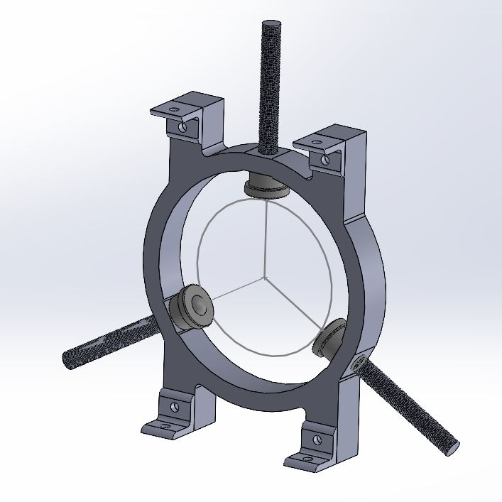
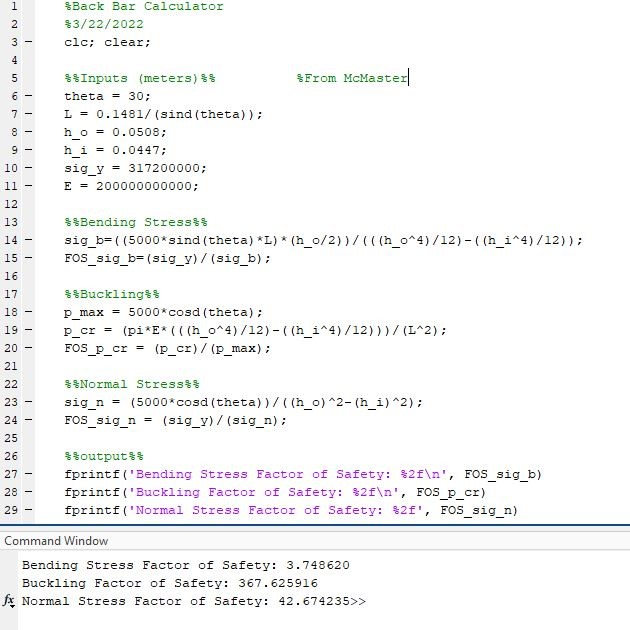

This year, I had the opportunity to join the propulsion sub-team for the UF Swamp Launch Rocket Team. The primary task at the time was to design and build a test-stand to hold a rocket motor and to measure its thrust as it fires. This kind of device is crucial for the team to be able to create rocket motors from scratch, so they can compare their thrust output to commercially available motors. Moving forward, we will use this test-stand to fine-tune rocket fuel formulations to create the best motors we can.

In this project, my primary focus was on modeling components of the test-stand, and developing factor of safety calculators in MATLAB. In SolidWorks, I designed the centering ring assembly that would support the rocket motor as it fired. This component featured ball bearings that would hold the motor at three points around its circumference. These bearings needed to be free to move continuously in the radial direction, so I chose stud-mounted ball bearings that could screw in and out to support motors of non-standard sizes. To ensure our design could support the forces of the firing rocket motor, I did stress and factor of safety calculations for several components. Then I used these calculations to create MATLAB programs that allowed us to vary the dimesions of the components to find the lightest, cheapest design possible. I was also active in the testing and calibration phases for our final design, and helped make sure we could accurately measure rocket thrust.

Below is an up close photo of my initial design for the centering ring, and a small sample of one of my MATLAB programs

  
  

